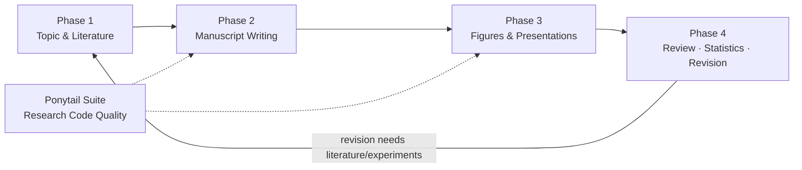

# codex-research-workflow

**Chinese-first, end-to-end academic research workflow router (Agent Skill)**

[](SKILL.md)
[](LICENSE)
[]()
[](#skill-routing-table)

**English** | [中文](README.zh-CN.md)

---

> ✅ This repository is a **complete skill pack**: the `skills/` subdirectory already contains all 30 specialist skills coordinated by this workflow (including their scripts and resources). Clone/copy and it works out of the box (see [Installation](#installation)).

## Contents

- [Overview](#overview)
- [Design Goals](#design-goals)
- [Workflow at a Glance](#workflow-at-a-glance)
- [Phase Details](#phase-details)
  - [Phase 1: Topic and Literature](#phase-1-topic-and-literature)
  - [Phase 2: Manuscript Writing](#phase-2-manuscript-writing)
  - [Phase 3: Figures and Presentations](#phase-3-figures-and-presentations)
  - [Research Code Quality (Ponytail Suite)](#research-code-quality-ponytail-suite)
  - [Phase 4: Review, Statistics, and Coordination](#phase-4-review-statistics-and-coordination)
- [Skill Routing Table](#skill-routing-table)
- [Coordination Rules](#coordination-rules)
- [Typical Use Cases and Entry Prompts](#typical-use-cases-and-entry-prompts)
- [Installation](#installation)
- [Repository Layout](#repository-layout)
- [Notes and Limitations](#notes-and-limitations)
- [FAQ](#faq)
- [Contributing](#contributing)
- [License](#license)

---

## Overview

`codex-research-workflow` is an **Agent Skill** built for researchers. It does not execute tasks directly; instead it acts as the dispatcher/router: based on the user's current research stage and request, it assigns work to the most suitable specialist skill and keeps context consistent across the whole project lifecycle — including the user's language preference (Chinese-first), target journal or conference, evidence standard, and expected deliverable format.

A full research cycle spans many tools and stages: exploring directions, collecting literature, reading PDFs, drafting, making figures, building slides, handling peer review, checking statistics, and cleaning up research code. Asking the AI separately at each step easily loses context and consistency. The goal of this skill is to keep **one research project moving through multiple stages without losing context**:

- Remember and carry forward the user's language setup (e.g., discuss in Chinese + write in English);
- Remember the target journal/conference and its citation format requirements;
- Reuse existing artifacts (review drafts, figures, data) instead of rewriting them;
- Distinguish "facts from literature", "user-provided results", "model interpretation", and "proposed next steps"; never present inference as fact;
- Never invent bibliographic metadata, experimental results, or citations.

## Design Goals

| Goal | Description |
| --- | --- |
| Chinese-first | Communicates in Chinese by default; produces academically polished English manuscripts |
| End-to-end | Covers topic → literature → writing → figures/slides → review/revision → statistics → code quality |
| Phase routing | Identifies the current phase and automatically picks the best-matching specialist skill |
| Context continuity | Preserves sources, decisions, artifact lists, and open items across phases |
| Evidence discipline | Traceable citations; volatile claims verified against authoritative sources; never fabricates |

## Workflow at a Glance



The four phases are not strictly sequential — you can enter any phase as needed. When a revision requires new literature or experiments, the flow loops back to earlier phases.

## Phase Details

### Phase 1: Topic and Literature

From a vague research direction to a writable review or paper topic.

| Skill | Purpose | Typical input → output |
| --- | --- | --- |
| `scientific-brainstorming` | Frontier exploration, topic ideation, finding research gaps | A broad direction → candidate topics + gap analysis |
| `nature-academic-search` | Query expansion and core-literature discovery | Keywords/research question → expanded queries + core paper leads |
| `literature-downloader` | Batch links, abstracts, and legally available full text | Paper list → link batches + abstract digest |
| `pdf-inspector` | PDF classification, structured text extraction, Markdown conversion; routes scanned pages to OCR | A batch of PDFs → classification + structured text/Markdown |
| `nature-reader` | Deep reading of one paper (methods, figures, results, conclusions) | One paper → deep-reading notes |
| `literature-review` | Cross-paper synthesis and review drafting | Reading notes → review draft |

### Phase 2: Manuscript Writing

From Chinese ideas to an English manuscript, then dual polishing of language and citations.

| Skill | Purpose | Typical input → output |
| --- | --- | --- |
| `nature-writing` | Turn Chinese ideas, study plans, or results into an English manuscript structure or draft | Chinese notes/outline → English structure + draft |
| `nature-polishing` | Polish English academic logic, phrasing, and style | English paragraphs → tighter academic prose |
| `nature-citation` | Citation placement, provenance checks, target-journal reference formatting | Manuscript + target journal → citation advice + formatted references |
| `academic-humanizer` | Make English scientific writing more natural, author-specific, and evidence-grounded (reducing AIGC traces) | English sections → more natural academic prose |
| `humanizer-zh-academic` | Make Chinese academic writing more natural while preserving scholarly meaning and discipline conventions | Chinese sections → more natural Chinese academic prose |

> **Humanizer red line**: both humanizers must preserve technical meaning, numbers, citations, limitations, and the author's actual claims; never fabricate data, citations, or personal experience.

### Phase 3: Figures and Presentations

Publication-quality figures and presentation slides of all kinds.

| Skill | Purpose | Typical input → output |
| --- | --- | --- |
| `nature-figure` / `scientific-visualization` | Publication-quality data plots and mechanism diagrams | Data/sketch needs → submission-ready figures |
| `image-to-editable-ppt` | Rebuild screenshots, paper figures, or sketches as editable slide elements | Image → editable PPT elements |
| `nature-paper2ppt` | Build a Chinese presentation from a single paper | One paper → Chinese presentation deck |
| `academic-slide-minimalist` | Minimalist slide design for literature reports | Literature content → minimalist deck |
| `academic-slide-pragmatic-fallback` | Reliable fallback slide design | Any content → stable, usable deck layout |
| `academic-research-suite` | Multi-paper review presentations and staged artifact management | Multiple papers → review deck + staged artifacts |

### Research Code Quality (Ponytail Suite)

A "just enough is best" philosophy for research code: prefer the smallest adequate implementation and avoid over-engineering.

| Skill | Purpose |
| --- | --- |
| `ponytail` | Prefer the smallest adequate implementation while coding; avoid unnecessary complexity |
| `ponytail-audit` | Audit a whole repository for over-engineering and avoidable complexity |
| `ponytail-debt` | Collect and organize `ponytail:` comments and deferred simplifications |
| `ponytail-gain` | Report the measured impact of simplification changes |
| `ponytail-help` | Quick-reference card for the Ponytail suite |
| `ponytail-review` | Code review focused on unnecessary complexity and simpler alternatives |

### Phase 4: Review, Statistics, and Coordination

Quality gates around submission and global coordination.

| Skill | Purpose | Typical input → output |
| --- | --- | --- |
| `nature-reviewer` | Reviewer-style audit of novelty, evidence, experiments, and unsupported conclusions | Manuscript → reviewer-style issue list |
| `nature-response` | Decompose reviewer comments and plan responses and revisions | Review comments → point-by-point response + revision plan |
| `statistical-analysis` | Statistical method selection, assumption checks, and reporting standards | Analysis plan/results → method fit + reporting advice |
| `academic-research-suite` | Coordinate staged research-to-paper work and preserve intermediate artifacts | Project status → stage plan + artifact list |
| `office-academic-skill` / `research-writing-skill` / `scientific-toolkit-skill` | Chinese-first Word, PowerPoint, research writing, and scientific computing tasks | Office/computing needs → documents and scripts |

## Skill Routing Table

This workflow currently coordinates the following **30 specialist skills** (all shipped in the repository's `skills/` directory):

| # | Skill | Phase |
| --- | --- | --- |
| 1 | `scientific-brainstorming` | Phase 1 Topic & Literature |
| 2 | `nature-academic-search` | Phase 1 Topic & Literature |
| 3 | `literature-downloader` | Phase 1 Topic & Literature |
| 4 | `pdf-inspector` | Phase 1 Topic & Literature |
| 5 | `nature-reader` | Phase 1 Topic & Literature |
| 6 | `literature-review` | Phase 1 Topic & Literature |
| 7 | `nature-writing` | Phase 2 Manuscript Writing |
| 8 | `nature-polishing` | Phase 2 Manuscript Writing |
| 9 | `nature-citation` | Phase 2 Manuscript Writing |
| 10 | `academic-humanizer` | Phase 2 Manuscript Writing |
| 11 | `humanizer-zh-academic` | Phase 2 Manuscript Writing |
| 12 | `nature-figure` | Phase 3 Figures & Presentations |
| 13 | `scientific-visualization` | Phase 3 Figures & Presentations |
| 14 | `image-to-editable-ppt` | Phase 3 Figures & Presentations |
| 15 | `nature-paper2ppt` | Phase 3 Figures & Presentations |
| 16 | `academic-slide-minimalist` | Phase 3 Figures & Presentations |
| 17 | `academic-slide-pragmatic-fallback` | Phase 3 Figures & Presentations |
| 18 | `academic-research-suite` | Phase 3 / Phase 4 |
| 19 | `ponytail` | Research Code Quality |
| 20 | `ponytail-audit` | Research Code Quality |
| 21 | `ponytail-debt` | Research Code Quality |
| 22 | `ponytail-gain` | Research Code Quality |
| 23 | `ponytail-help` | Research Code Quality |
| 24 | `ponytail-review` | Research Code Quality |
| 25 | `nature-reviewer` | Phase 4 Review & Statistics |
| 26 | `nature-response` | Phase 4 Review & Statistics |
| 27 | `statistical-analysis` | Phase 4 Review & Statistics |
| 28 | `office-academic-skill` | Phase 4 Coordination |
| 29 | `research-writing-skill` | Phase 4 Coordination |
| 30 | `scientific-toolkit-skill` | Phase 4 Coordination |

## Coordination Rules

The router follows these rules:

1. **Identify the phase before dispatching**: confirm the current phase, inputs, target output, language, target venue, and evidence standard before routing.
2. **Execute in dependency order**: for multi-phase requests, execute in dependency order and keep a compact project record (sources, decisions, artifacts, open items).
3. **Reuse, don't rewrite**: reuse existing artifacts; clearly separate "sourced facts", "user-provided results", "interpretation", and "proposed next steps".
4. **Zero tolerance for fabricated citations**: verify volatile or time-sensitive claims with authoritative sources; never invent bibliographic metadata.
5. **Faithful rewriting**: humanization must preserve technical meaning, numbers, citations, limitations, and the author's actual claims.
6. **Minimum necessary questions**: ask only when a missing topic, paper, dataset, target journal, or output format blocks a safe and useful next step; otherwise make the smallest explicit assumption and continue.

## Typical Use Cases and Entry Prompts

The following entry prompts trigger the workflow directly (prompts may be given in Chinese or English):

| Scenario | Example prompt |
| --- | --- |
| Full-cycle topic development | "Start from a research direction and complete topic selection, search, reading, and a review draft." |
| Paper to presentation | "Deep-read this paper and build a Chinese presentation deck." |
| Chinese-to-English drafting | "Turn my Chinese research ideas into an English draft, then polish the language and check citations." |
| Handling peer review | "Plan the revision route from the reviewer comments and check the statistical methods." |
| Code slimming | "Audit this analysis repository for over-engineering and propose simplifications." |
| PDF batch processing | "Classify this batch of PDFs, extract the text, and convert it to Markdown for a later review." |

**Expected behavior**: the agent first determines your stage and deliverable type, invokes the matching specialist skill, and keeps language, venue requirements, evidence standards, and intermediate artifacts consistent across steps.

## Installation

This skill follows the Agent Skills `SKILL.md` convention (YAML frontmatter provides `name` and `description`). It works on agent platforms that support this convention.

### Option 1: Clone the whole repository

```bash
git clone https://github.com/changzhanyou0215/codex-research-workflow.git
```

The repository's `skills/` directory already contains all 30 specialist skills. Installation = copy each skill directory under `skills/` into your platform's skill directory:

```bash
# Example: copy all skills into the opencode skills directory
xcopy /E /I codex-research-workflow\skills\* <platform-skills-dir>\
```

Make sure the final layout looks like:

```text
<skills dir>/codex-research-workflow/SKILL.md        # router
<skills dir>/nature-writing/SKILL.md                 # specialist skills
<skills dir>/pdf-inspector/SKILL.md
...
```

Common platform directories (check each platform's official docs):

- **opencode**: `.opencode/skill/`
- **Claude Code**: `.claude/skills/`
- **Codex CLI**: `~/.codex/skills/`

### Option 2: Install the main skill only

Copy just `SKILL.md` into a same-named folder in your platform's skill directory to get routing capability; to actually execute stage tasks, also copy the matching skills under `skills/`.

### About the complete skill pack

- This repository is **not just the router**: `skills/` ships all 30 coordinated specialist skills with their scripts and resources (PDF tooling, figure templates, PPT templates, statistics tooling, etc.), about 95 MB and 4,000+ files in total.
- Skills are kept in sync with this repository version; to update a single skill, copy the new skill directory over the matching directory in `skills/` and commit.
- After installing, just ask your agent: "List the currently available skills." to verify loading.

## Repository Layout

```text
codex-research-workflow/
├── SKILL.md            # router main file (frontmatter metadata + full routing logic)
├── README.md           # English documentation (this file)
├── README.zh-CN.md     # Chinese documentation
├── LICENSE             # MIT license
└── skills/             # complete skill pack: all 30 coordinated specialist skills
    ├── scientific-brainstorming/
    ├── nature-academic-search/
    ├── pdf-inspector/
    ├── nature-writing/
    ├── ponytail/
    ├── academic-research-suite/
    └── ... (30 skill directories with scripts and resources)
```

## Notes and Limitations

- This skill aims to improve writing and workflow quality; it **does not claim to bypass any AI detector**. The humanizers improve authorship, clarity, specificity, and natural scholarly voice.
- Humanized rewriting strictly preserves meaning, citations, limitations, and evidence; it will not sacrifice academic accuracy to "lower detection rates".
- For research questions where facts may change (latest progress, data, policies), defer to current authoritative sources.
- All specialist skills ship with the pack, but some (e.g., `pdf-inspector`, `nature-figure`) depend on specific runtimes (Python libraries, PDF/OCR tools); check each skill's SKILL.md for environment dependencies before use.

## FAQ

**Q1: Does installing only this SKILL.md give me full functionality?**
Installing only `SKILL.md` gives routing/dispatch capability. Full functionality requires no extra downloads — the `skills/` directory already ships all 30 specialist skills; copy them into your skills directory the same way.

**Q2: Does it support English-only projects?**
Yes. "Chinese-first" refers to the default communication language and deep support for Chinese input; English writing, polishing, and humanization are equally core capabilities.

**Q3: Will it automatically download paywalled papers?**
No. It does not bypass copyright. `literature-downloader` only organizes link batches, abstracts, and legally available full text.

**Q4: How do I make it remember my target journal?**
State the target journal explicitly in the session; the routing rules require it to preserve that setting across the project and apply it when formatting citations.

## Contributing

Issues and Pull Requests are welcome:

1. Fork this repository and create a branch;
2. Modify `SKILL.md` or the documentation;
3. Open a PR describing motivation and scope.

Feedback: [Issues](https://github.com/changzhanyou0215/codex-research-workflow/issues)

## License

Released under the [MIT License](LICENSE).
