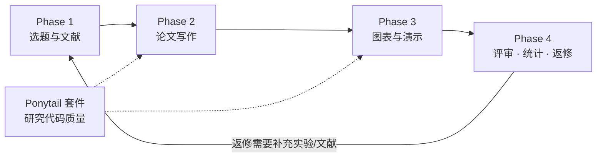

# codex-research-workflow

<div align="center">

**中文优先的端到端学术科研工作流路由器（Agent Skill）**

[](SKILL.md)
[](LICENSE)
[]()
[](#技能路由总表)

</div>

---

## English TL;DR

`codex-research-workflow` is a **workflow router skill** for AI coding/research agents (Codex-style tools that follow the `SKILL.md` convention). It coordinates a Chinese-first, end-to-end academic research pipeline: topic discovery → literature processing → manuscript writing → figures & presentations → peer review & revision → statistics → research-code quality. It routes each user request to the most suitable specialist skill while preserving the user's language, target venue, evidence standard, and output format. It never invents citations, data, or results.

> ⚠️ This repository ships the **router** only. It coordinates 29 specialist skills; install those skills alongside for full functionality (see [安装](#安装)).

---

## 目录

- [项目简介](#项目简介)
- [设计目标](#设计目标)
- [工作流总览](#工作流总览)
- [各阶段详解](#各阶段详解)
  - [Phase 1：选题与文献](#phase-1选题与文献)
  - [Phase 2：论文写作](#phase-2论文写作)
  - [Phase 3：图表与演示](#phase-3图表与演示)
  - [研究代码质量（Ponytail 套件）](#研究代码质量ponytail-套件)
  - [Phase 4：评审、统计与协调](#phase-4评审统计与协调)
- [技能路由总表](#技能路由总表)
- [协调规则](#协调规则)
- [典型使用场景与入口指令](#典型使用场景与入口指令)
- [安装](#安装)
- [仓库结构](#仓库结构)
- [注意事项与局限性](#注意事项与局限性)
- [常见问题 FAQ](#常见问题-faq)
- [贡献](#贡献)
- [许可证](#许可证)

---

## 项目简介

`codex-research-workflow` 是一个面向科研人员的 **Agent Skill（智能体技能）**。它本身不直接执行具体任务，而是充当"总调度 / 路由器"：根据用户当前所处的科研阶段和请求内容，把工作分派给最合适的专项技能，并在整个项目周期中保持上下文一致——包括用户的语言偏好（中文优先）、目标期刊或会议、证据标准以及期望的交付格式。

一次完整的科研流程往往横跨多个工具和阶段：查方向、下文献、读 PDF、写初稿、做图、做幻灯片、应对审稿、核对统计方法、整理代码。如果每一步都单独向 AI 提问，上下文很容易丢失、口径容易漂移。本技能的目标就是让 **一个科研项目在多阶段推进时不丢上下文**：

- 记住并延续用户设定的语言（如中文交流 + 英文成稿）；
- 记住目标期刊/会议及其引用格式要求；
- 复用已有产物（综述草稿、图表、数据），而不是每次重写；
- 区分"文献中的事实"、"用户提供的结果"、"模型解读"、"建议的下一步"，不把推断说成事实；
- 不虚构文献元数据、实验结果或引文。

## 设计目标

| 目标 | 说明 |
| --- | --- |
| 中文优先 | 默认以中文与用户沟通，可产出符合学术规范的英文稿件 |
| 端到端 | 覆盖选题 → 文献 → 写作 → 图表/演示 → 评审/返修 → 统计 → 代码质量全流程 |
| 阶段路由 | 按 Phase 识别当前任务，自动选择最匹配的专项技能 |
| 上下文连续 | 跨阶段保留来源、决策、产物清单与待办事项 |
| 证据严谨 | 引文可溯源；不稳定信息用权威来源核验；绝不编造 |

## 工作流总览



四个阶段并非严格串行，可以按需进入任意阶段；当返修需要补文献或补实验时，流程会回环到前面的阶段。

## 各阶段详解

### Phase 1：选题与文献

从模糊的研究方向出发，逐步收敛为可写的综述或论文选题。

| 技能 | 用途 | 典型输入 → 输出 |
| --- | --- | --- |
| `scientific-brainstorming` | 前沿探索、选题构思、寻找研究空白（research gap） | 一个大方向 → 候选课题清单与研究空白分析 |
| `nature-academic-search` | 检索式扩展与核心文献发现 | 关键词/研究问题 → 扩展检索式 + 核心论文线索 |
| `literature-downloader` | 批量获取链接、摘要及合法可得的全文本 | 论文列表 → 链接批次 + 摘要汇编 |
| `pdf-inspector` | PDF 分类、结构化文本抽取、转 Markdown；扫描页路由到 OCR | 一批 PDF → 分类结果 + 结构化文本/Markdown |
| `nature-reader` | 单篇论文精读（方法、图、结果、结论） | 一篇论文 → 深度阅读笔记 |
| `literature-review` | 跨论文综合与综述草稿撰写 | 多篇精读笔记 → 综述草稿 |

### Phase 2：论文写作

从中文思路到英文成稿，再到语言与引用的双重打磨。

| 技能 | 用途 | 典型输入 → 输出 |
| --- | --- | --- |
| `nature-writing` | 将中文想法、研究计划或结果转化为英文论文结构或初稿 | 中文笔记/提纲 → 英文稿结构与草稿 |
| `nature-polishing` | 打磨英文学术逻辑、措辞与文体 | 英文段落 → 更严谨流畅的学术表达 |
| `nature-citation` | 引用位置检查、出处核验、按目标期刊格式排版参考文献 | 稿件 + 目标期刊 → 引用建议与规范化参考文献 |
| `academic-humanizer` | 让英文科技写作更自然、更具作者个人风格、更贴合证据（降低 AIGC 痕迹） | 英文章节 → 更自然的学术行文 |
| `humanizer-zh-academic` | 让中文学术写作更自然，同时保留学术含义与学科表达习惯 | 中文章节 → 更自然的中文学术行文 |

> **Humanizer 红线**：两个 humanizer 都必须保留技术含义、数字、引用、局限性与作者的真实主张；绝不伪造数据、引用或个人经历。

### Phase 3：图表与演示

出版级图片与各类汇报幻灯片。

| 技能 | 用途 | 典型输入 → 输出 |
| --- | --- | --- |
| `nature-figure` / `scientific-visualization` | 出版级数据图与机制示意图 | 数据/示意需求 → 可发表质量的图 |
| `image-to-editable-ppt` | 把截图、论文插图或手绘草图重建为可编辑幻灯片元素 | 图片 → 可编辑 PPT 元素 |
| `nature-paper2ppt` | 从单篇论文生成中文汇报演示 | 一篇论文 → 中文汇报 PPT |
| `academic-slide-minimalist` | 简洁风格的文献汇报幻灯片设计 | 文献内容 → 极简风幻灯片 |
| `academic-slide-pragmatic-fallback` | 可靠的兜底幻灯片设计方案 | 任意内容 → 稳定可用的幻灯片版式 |
| `academic-research-suite` | 多论文综述型演示与阶段性成果管理 | 多篇论文 → 综述演示 + 分阶段产物 |

### 研究代码质量（Ponytail 套件）

针对科研代码的"够用就好"哲学：优先最小充分实现，避免过度工程。

| 技能 | 用途 |
| --- | --- |
| `ponytail` | 编码时倾向最小充分实现，避免不必要的复杂性 |
| `ponytail-audit` | 对整个仓库进行过度工程与可避免复杂度的审计 |
| `ponytail-debt` | 收集并归档 `ponytail:` 注释与被推迟的简化事项 |
| `ponytail-gain` | 汇报简化改动带来的可度量收益 |
| `ponytail-help` | Ponytail 套件的快速参考卡 |
| `ponytail-review` | 聚焦"不必要的复杂度与更简替代方案"的代码评审 |

### Phase 4：评审、统计与协调

投稿前后的质量把关与全局协调。

| 技能 | 用途 | 典型输入 → 输出 |
| --- | --- | --- |
| `nature-reviewer` | 以审稿人视角审计创新性、证据、实验与缺乏支撑的结论 | 稿件 → 审稿式问题清单 |
| `nature-response` | 拆解审稿意见，规划回复与返修路线 | 审稿意见 → 逐条回复方案 + 返修计划 |
| `statistical-analysis` | 统计方法选择、前提假设核查与报告规范检查 | 分析方案/结果 → 方法适用性与报告建议 |
| `academic-research-suite` | 协调分阶段的"研究→论文"工作流，保存中间产物 | 项目状态 → 阶段推进计划与产物清单 |
| `office-academic-skill` / `research-writing-skill` / `scientific-toolkit-skill` | 中文优先的 Word、PowerPoint、科研写作与科学计算任务 | 各类办公/计算需求 → 对应文档与脚本 |

## 技能路由总表

本工作流目前协调以下 **29 个专项技能**：

| # | 技能 | 所属阶段 |
| --- | --- | --- |
| 1 | `scientific-brainstorming` | Phase 1 选题与文献 |
| 2 | `nature-academic-search` | Phase 1 选题与文献 |
| 3 | `literature-downloader` | Phase 1 选题与文献 |
| 4 | `pdf-inspector` | Phase 1 选题与文献 |
| 5 | `nature-reader` | Phase 1 选题与文献 |
| 6 | `literature-review` | Phase 1 选题与文献 |
| 7 | `nature-writing` | Phase 2 论文写作 |
| 8 | `nature-polishing` | Phase 2 论文写作 |
| 9 | `nature-citation` | Phase 2 论文写作 |
| 10 | `academic-humanizer` | Phase 2 论文写作 |
| 11 | `humanizer-zh-academic` | Phase 2 论文写作 |
| 12 | `nature-figure` | Phase 3 图表与演示 |
| 13 | `scientific-visualization` | Phase 3 图表与演示 |
| 14 | `image-to-editable-ppt` | Phase 3 图表与演示 |
| 15 | `nature-paper2ppt` | Phase 3 图表与演示 |
| 16 | `academic-slide-minimalist` | Phase 3 图表与演示 |
| 17 | `academic-slide-pragmatic-fallback` | Phase 3 图表与演示 |
| 18 | `academic-research-suite` | Phase 3 / Phase 4 |
| 19 | `ponytail` | 研究代码质量 |
| 20 | `ponytail-audit` | 研究代码质量 |
| 21 | `ponytail-debt` | 研究代码质量 |
| 22 | `ponytail-gain` | 研究代码质量 |
| 23 | `ponytail-help` | 研究代码质量 |
| 24 | `ponytail-review` | 研究代码质量 |
| 25 | `nature-reviewer` | Phase 4 评审与统计 |
| 26 | `nature-response` | Phase 4 评审与统计 |
| 27 | `statistical-analysis` | Phase 4 评审与统计 |
| 28 | `office-academic-skill` | Phase 4 协调 |
| 29 | `research-writing-skill` / `scientific-toolkit-skill` | Phase 4 协调 |

## 协调规则

本技能在调度时遵循以下规则：

1. **先定阶段再派活**：路由前先确认当前阶段、输入、目标产物、语言、目标期刊与证据标准。
2. **按依赖顺序执行**：若请求涉及多个阶段，按依赖顺序执行，并维护一份紧凑的项目记录（来源、决策、产物、未决事项）。
3. **复用而非重写**：已有产物直接复用；明确区分"有来源的事实"、"用户提供的结果"、"解读"、"建议的下一步"。
4. **引文零容忍造假**：对文献与引用，用权威来源核验易变或时效性主张，绝不编造文献元数据。
5. **改写保真**：人性化改写（humanization）必须保留技术含义、数字、引用、局限性与作者真实主张。
6. **最小必要提问**：仅当缺少主题、论文、数据、目标期刊或输出格式会阻碍下一步安全执行时才追问；否则做出最小的显式假设并继续。

## 典型使用场景与入口指令

以下入口请求可直接触发本工作流：

| 场景 | 示例指令 |
| --- | --- |
| 全流程开题 | "从研究方向开始，完成选题、检索、阅读和综述草稿。" |
| 论文转汇报 | "把这篇论文精读后制作中文汇报 PPT。" |
| 中译英成稿 | "将中文研究思路写成英文初稿，再进行学术润色和引用检查。" |
| 应对审稿 | "根据审稿意见制定返修路线并检查统计方法。" |
| 代码瘦身 | "审查这个分析仓库是否存在过度工程，并给出简化方案。" |
| PDF 批处理 | "把这批 PDF 分类、抽取文本并转成 Markdown，供后续综述使用。" |

**预期行为**：Agent 会先判断你所处的阶段与交付物类型，调用对应专项技能执行，并在跨步骤之间保持语言、期刊要求、证据标准与中间产物的一致性。

## 安装

本技能遵循 Agent Skills 的 `SKILL.md` 约定（YAML frontmatter 提供 `name` 与 `description`）。适用于支持该约定的智能体平台。

### 方式一：克隆整个仓库

```bash
git clone https://github.com/changzhanyou0215/codex-research-workflow.git
```

然后将包含 `SKILL.md` 的文件夹复制到你所用平台加载技能的目录，确保路径形如：

```text
<skills 目录>/codex-research-workflow/SKILL.md
```

常见平台示例（以各平台官方文档为准）：

- **opencode**：`.opencode/skill/codex-research-workflow/SKILL.md`
- **Claude Code**：`.claude/skills/codex-research-workflow/SKILL.md`
- 其他支持 SKILL.md 约定的工具，请参照其文档放置。

### 方式二：手动复制

只需把本仓库中的 `SKILL.md` 放入平台技能目录下的同名文件夹即可；`README.md` 与 `LICENSE` 仅用于 GitHub 展示，非运行必需。

### 重要提示

- 本技能是 **路由器**。要获得完整能力，需要同时安装它所协调的 29 个专项技能；只装路由器时，Agent 能理解流程但无法调用具体专长。
- 各专项技能是否已随你的环境安装，可直接询问你的 Agent："列出当前可用的技能。"

## 仓库结构

```text
codex-research-workflow/
├── SKILL.md      # 技能主文件（含 frontmatter 元数据与完整路由逻辑）
├── README.md     # 本说明文档
└── LICENSE       # MIT 许可证
```

## 注意事项与局限性

- 本技能旨在提升写作与流程质量，**不承诺绕过任何 AI 检测器**；humanizer 的定位是改善作者性、清晰度、具体性与自然学术语感。
- 人性化改写会严格保留含义、引用、局限性与证据，因此不会为了"降检测率"而牺牲学术准确性。
- 涉及事实可能变化的研究问题（最新进展、数据、政策等），应以现行权威来源核验为准。
- 本仓库不包含各专项技能的实现，仅包含路由逻辑。

## 常见问题 FAQ

**Q1：只安装这一个 SKILL.md 就能用全部功能吗？**
不能。它是调度层，需要配合其协调的专项技能一起安装才能实际执行各阶段任务。

**Q2：支持纯英文项目吗？**
支持。"中文优先"指默认沟通语言与中文输入的深度支持，英文写作、润色与改写同样是核心能力。

**Q3：它会帮我自动下载付费论文吗？**
不会绕过版权限制。`literature-downloader` 只处理链接批量整理、摘要与合法可获得的全文本。

**Q4：如何让它记住我的目标期刊？**
在同一会话中明确告知目标期刊即可；路由规则要求它在整个项目周期内保持该设定并在引用排版时应用。

## 贡献

欢迎通过 Issue 与 Pull Request 参与改进：

1. Fork 本仓库并新建分支；
2. 修改 `SKILL.md` 或文档；
3. 提交 PR 并说明动机与影响范围。

反馈渠道：[Issues](https://github.com/changzhanyou0215/codex-research-workflow/issues)

## 许可证

本项目基于 [MIT License](LICENSE) 开源。
